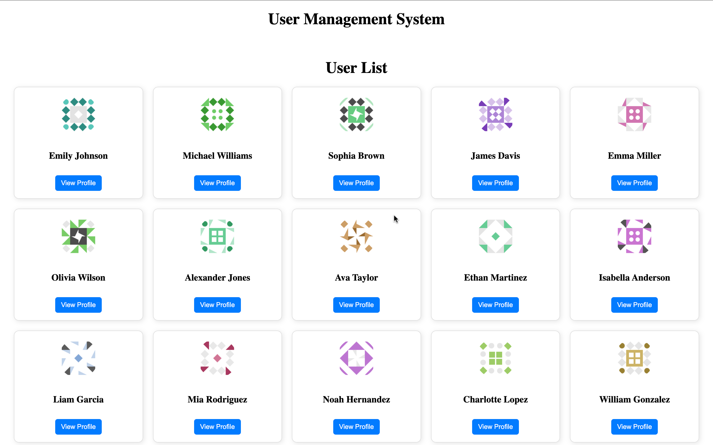
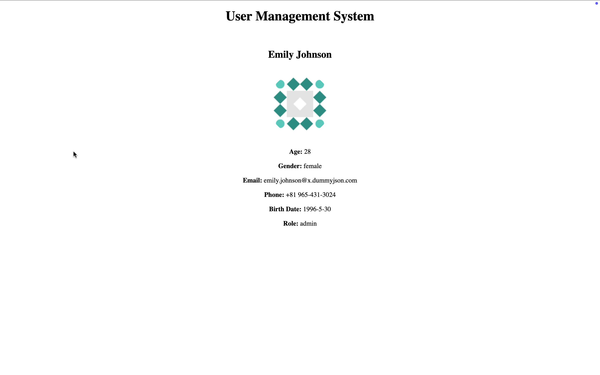

# Frontend Application

This is a React-based frontend application that interacts with a backend API to display a list of users and their details.

## Features
- Fetches and displays a list of users from the backend.
- Displays user details when clicking on a specific user.
- Uses React Router for navigation.
- Uses React Query for data fetching and state management.
- Responsive card-based UI for user display.

## Prerequisites
Before running the project, ensure you have the following installed:
- [Node.js](https://nodejs.org/) (Recommended version: 18+)
- [npm](https://www.npmjs.com/) or [yarn](https://yarnpkg.com/)

## Installation
Clone the repository and install dependencies:

```sh
git clone https://github.com/amitvish/Ecommerce-Frontend
cd Ecommerce-Frontend
npm install
```

## Running the Development Server
Start the frontend development server:

```sh
npm run dev
```

By default, the application runs on `http://localhost:5173/`.

## Project Structure
```
frontend/
├── src/
│   ├── components/       # Reusable UI components
│   ├── pages/            # Page components
│   ├── hooks/            # Custom hooks (e.g., data fetching)
│   ├── App.jsx           # Main application component
│   ├── main.jsx          # Entry point for React
│   └── styles.css        # Global styles
├── public/               # Static assets
├── package.json          # Project dependencies
├── vite.config.js        # Vite configuration
└── README.md             # Project documentation
```

## API Configuration
This frontend fetches user data from the backend API hosted at:
```
http://localhost:8081/api/users/
```
Ensure the backend server is running before accessing the frontend.

## Build for Production
To create a production build:

```sh
npm run build
```

This generates an optimized `dist/` folder ready for deployment.

## Troubleshooting
- If you encounter a **CORS issue**, ensure the backend allows requests from `http://localhost:5173`.
- If the API requests fail, check if the backend server is running at the correct port.
- Ensure you have installed dependencies using `npm install` before running the project.

## Application Screenshots  
### Home Page  
  

### User Details Page  
  


